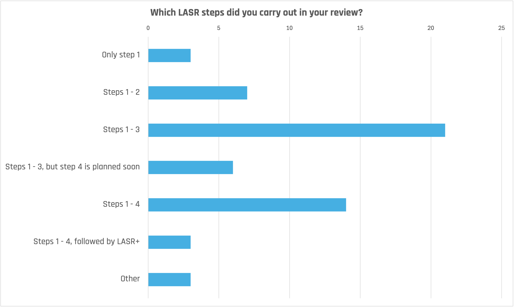
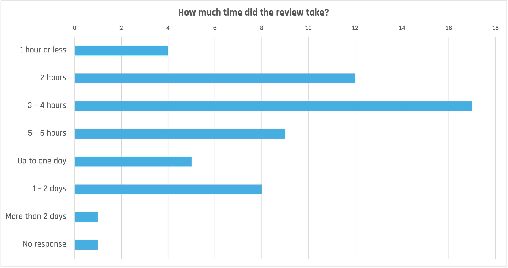

## About the Survey

To better understand how [LASR](https://www.lasr-reviews.org), the Lightweight Approach for Software Reviews, is used in practice, Stefan Toth and Stefan Zörner conducted a small survey in November 2025.
It targeted people who were familiar with LASR and had already applied it to some extent.
Respondents were asked to provide information about a specific LASR review within their company or organization.
We distributed the survey to the LASR community via email and LinkedIn and received 57 responses within one week.

## Approach and First Results

We conducted the survey using Google Forms, with both a German and an English version.
The questions were the same:

* In which industry is the software system under review used?
* How long has the software been in production?
* Which LASR steps did you carry out in your review?
* How many people were directly involved in carrying out the review?
* How much time did the review take?
* How many risks did you identify during LASR steps 3 and, if applicable, 4?
* Did you and your team make further use of the review results afterwards?
* How did you make further use of the review results afterwards?

The raw data from the survey responses is available as CSV files in the *data* subdirectory.
We will analyze it and share the results. 

As a preview, here the results for two questions, EN an DE responses combined.

